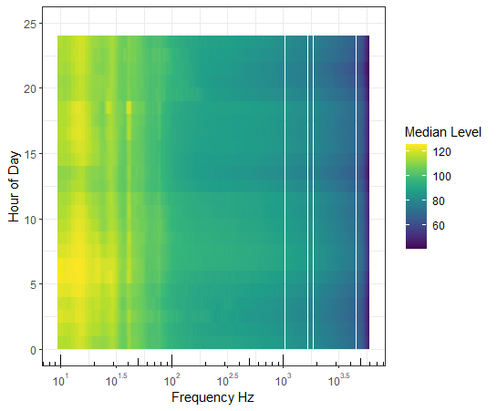

```{r setup, include=FALSE}
knitr::opts_chunk$set(echo = TRUE)
```

## Brief Tutorial

This tutorial provides concrete example of setting up and using a series of functions to process sound data. Ultimately, this should be a GUI, but for the meantime, some R knowledge will be required.

## Setting up the soundfiles and the project

This code is structured such that data are exported to hdf5 files. These large databases are capable of handling multiple types of data and grouping datasets. For our purposes we often evaluate noise level data from multiple instruments across years and locations. Thus, the example code sets up the data assuming a higher project level and hydrophones as the lower level. Wihtin the hydrophone names we have the metrics of interest, broadband, hybrid-milidecade, and third octave sound levels. These are arranged with as datasets. Additionally, the analysis parameters, timestamps, center frequencies of the third octave and hybrid-milidecade data are saved as independent datasets within each hydrophone.

If you don't want to muck around navigating to the functions directory, open the project and make sure you have the here library installed. The rest should just work.

```{r}


rm(list = ls())
library(here)
library(lubridate)
library(stringr)
library(rhdf5)


#Define path to functions that we will use
source(here('NoiseProcessingFxs.r'))
```

## Anlysis parameters

Here you set up the analysis parameters as you would in PAMGuide. While there are many fewer options then Dr. Merchant's version, there is more flexability in a few key ones. Importnatly, the ability to ignore the first few seconds of the file. Duty-cycled recordings often have a DC offset which will skew recording levels. Parameters are kept in a 'prms' dataframe.

```{r}


rm(list = ls())
library(here)
library(lubridate)
library(stringr)
library(rhdf5)


#Define path to functions that we will use
source(here('NoiseProcessingFxs.r'))
```

## Audio file directory

At present, this must be wav files. Which is a bummer.

This section of code creates a dataframe with the audio file names and locations and the audio start time (assuming UTC). The data locally are typically in one of a few formats so two examples are provided here.

```{r pressure, echo=FALSE}
plot(pressure)
```

```{r}
fileLoc = 'D:\\RECORDINGS\\SoundtrapST5987'
files <- (list.files(fileLoc[1], pattern = "\\.wav$"))

# Pattern 1 
nameStringPattern = '\\d{8}T\\d{6}.\\d{3}'
nameStringFormat =" %Y%m%dT%H%M%OS"

# Pattern 2 (Soundtrap PatternP
nameStringPattern = '\\d{12}'
nameStringFormat ='%y%m%d%H%M%OS'
lubradiateFormat ="ymdHMS"


# create df with start and end times of all files
audioData =data.frame(files = file.path(fileLoc, files))
audioData$FileName = files
audioData$TimeString=lapply(audioData$FileName, str_extract, 
                            pattern =nameStringPattern)

audioData$StartTime =parse_date_time(audioData$TimeString,
                                     lubradiateFormat,
                                     tz='UTC')
audioData$Duration = as.numeric(sapply(audioData$files, 
                                       av_media_info)["duration", ]) 
audioData$EndTime = audioData$StartTime+audioData$Duration
audioData$StartSample = ((0:(nrow(audioData)-1))*prms$Fs)+1
audioData$EndSample = audioData$StartSample+(audioData$Duration* prms$Fs)

```

Note that the `echo = FALSE` parameter was added to the code chunk to prevent printing of the R code that generated the plot.

## Analysis Parameters

The following section of code sets up the analysis parameters. These are standard metrics in acoustics such as sample rate (fs), fft length (samples, sorry Marie), and the averaging duration (welch) in seconds. Additional parameters are the option of removing the DC offset of the file once the sound is loaded by subtracting the mean. This was in the authors original version but here is set to an option (recommended to leave as TRUE).

The calibration value can either be end-to-end in decibels or a frequency response. Here I've simulated a frequency response calibration. This could otherwise be uploaded from a CSV or similar. Note that if the calibration values are less than the Nyquist frequency, the user needs to add a value at fs/2 to their calibration dataframe. The last section creates windowing values (vector) and defines alpha in accordance with the functions published in Merchant et al. 2014.

```{r}
################################################################
# Set up FFT metrics
################################################################
# Set up needed parameters

fileLoc = 'D:\\RECORDINGS\\ADRIFT_001_CENSOR_12kHz'
files <- (list.files(fileLoc[1], pattern = "\\.wav$"))

# Pull sample rate from first file, assume consistnat (required)
prms = av_media_info(file.path(fileLoc,files[1]))$audio
prms$duration = av_media_info(file.path(fileLoc,files[1]))$duration
colnames(prms)[colnames(prms)=='sample_rate']='Fs' # field standard
prms$N = prms$Fs # fft lenght in samples
prms$r = 0.5 # overlap in percent
prms$aveSec = 60 # averaging window (seconds)
prms$secSkip = 0 # number of seconds to skip when loading the file (soundtraps...)

# ratio of new to original window lengths in Welch method (avg over aveSec secs)
prms$welch = prms$aveSec*(prms$Fs/prms$N)/(1-prms$r)

# Analysis frequencies (hz). I do not reccomend setting the hi-cut to less than fs/2
prms$lcut =10
prms$hcut = prms$Fs

# Reference pressure, set to 1 for water
prms$pref =1

# remove DC offset by subtracting mean(yy) from yy
prms$rmDC = TRUE

# calibration, either end-to-end or frequency response
prms$freqCal= -175.5

# simulate frequency response (load from CSV or similar)
freqResp = data.frame(f = round(10:prms$Fs/2))
freqResp$E2E = seq(-185, -165, length.out = nrow(freqResp))
prms$freqCal= list(freqResp)

# Date the analysis was run
prms$DateRun = now(tzone = "UTC")


########################################################
# Create window functions as defined by NM 2014
####################################################

w = windowFunctions('hann', prms)[[1]]
prms$alpha = windowFunctions('hann', prms)[[1]]

```

## Database Initialization

The following section of code sets up the H5DF database including the study name and writes some of the data that we've already established (parameters and the audio data frame). These could be useful in troubleshooting the data after it's been processed.

The other important thing that happens in this bit of code is estimating the total number of rows that will ultimately be in the dataset. If you are planning on adding to the dataset at a later date (e.g. an instrument comes ashore, it's refurbished then returned to the field) then you need to ensure that the length is greater or equal to your ultimate length. In this case I know that I will not be adding to this dataset so I'm using the length of the time in minutes (**tt**) later on.

```{r}
# Database name and instrument
ProjName = paste0("AcousticStudy",format(Sys.time(), "%Y-%m-%d%H%M%S"), '.h5')
instrumentName = "ST5987"


# Create the  hdf5 file and fill out meta and audiofiles
h5createFile(ProjName)

# create group for location 1 (here we are going with just the hydrophone serial number). 
h5createGroup(ProjName, instrumentName)

# Write the parameters database to the instrument as well as the dataframe containing all the files used
h5write(
  prms,
  file =ProjName,
  paste(instrumentName,"Parms",sep="/"))

h5write(
  audioData$FileName,
  file = ProjName,
  paste(instrumentName,"Files",sep="/"))

##########################################################################
# Guesstimate total duration of the database, this should be revisited but works
# for now
##########################################################################
# figure out maximum dimensions of the output data
timesAll = seq(floor_date(min(audioData$StartTime), 'minute'),
               ceiling_date(max(audioData$EndTime), 'minute'),
               by = paste(prms$welch/2, 'sec'))

```

## Create the Noise Metrics

A custom function has been created to write the data to the database. The dataType is the name of the dataset, newData is the result of the analysis so will be the octave band levels, time, third octave band levels etc. Datastart is the index of where, in the dataset, the new data will be written. Thus if the analysis results in in a 6x5000 matrix for 6 minutes of the anlaysis the dataStart will be 1 on the first iteration followed by 7, 13, 19 and so forth. The data are organized such that columns represent frequencies and rows represent time. Max rows is the total number of rows that we expect in the dataset (as above). In my understanding its better to overestimate this, as I've done here. Storage mode is the type of data represented in the dataset. The default is double.

```{r}
  # Write the timestamps
  writeToH5datarH5df(ProjName, instrumentName,
                     dataType='timeUTC', 
                     newData = as.matrix(as.character(tt)), 
                     dataStart=((ii-1)*length(tt))+1,
                     maxRows=length(timesAll), 
                     storagemMode= 'character')
```

Putting the above functions in a loop, we now step through the the \*.wav file in the audiodata dataframe, calculates the PSS then passes that matrix to the measurement functions. On the first iteration of the loop, it calculates the center and frequency limits of the analysis bands given the user-defined frequency limits and writes that to the dataset. After the first iteration, new data are added to the same dataset.

```{r}
######################################################################
# Step through the soundfiles, create spectrogram and write to hdf5 file
#######################################################################
idStart =1


for(ii in 1:nrow(audioData)){
  
  
  # Calculate the PSS within the user defined range, time stamps, and frequency
  # vector.
  dataOut = calcPSS(audioData, ii, prms, w)
  
  # Initial audio calculation
  Psstrimmed= dataOut[[1]]
  tt= dataOut[[2]]
  f = dataOut[[3]]
  avPSD= 10*log10(Psstrimmed)
  
  # Hybrid milidecade from PSS
  hybridMilidecade = calcHybridMiDecade(prms, Psstrimmed, f, w)
  hybLevels = hybridMilidecade[[1]]
  hybFreqs = hybridMilidecade[[2]]
  
  # Third Ocatave Bands (checked)
  thirdOctBands= calcThirdOctBands(prms, Psstrimmed, tt,f)
  thridOctLevels = thirdOctBands[[1]]
  thirdOctF = thirdOctBands[[2]]
  
  # Broadband (checked)
  BroadBandLevels =calcBroadband(prms,dataOut[[1]]) 
  
  
  # First run, add add the frequency information 
  if(ii==1){
    # Create new datasets for the frequency information for each of our metrics (except broadband). Here decidecade and third octave. 
    
    
    # Write the hybrid frequencies
    writeToH5datarH5df(ProjName, instrumentName,
                       dataType='hybridDecFreqHz', # metric name
                       newData = hybFreqs$center,  # center frequncies
                       dataStart=1,
                       maxRows=nrow(hybFreqs),
                       storagemMode='double')
    
    
    # Write the third-octave frequencies
    writeToH5datarH5df(ProjName, instrumentName,
                       dataType='thirdOctFreqHz', 
                       newData = thirdOctF, 
                       dataStart=1,
                       maxRows= length(thirdOctF),
                       storagemMode='integer')
    }
  ###################################################
  # Add new data to the dataset
  ###################################################
  
  # Write the timestamps
  writeToH5datarH5df(ProjName, instrumentName,
                     dataType='timeUTC', 
                     newData = as.matrix(as.character(tt)), 
                     dataStart=((ii-1)*length(tt))+1,
                     maxRows=length(timesAll), 
                     storagemMode= 'character')
  
  # write the hybrid milidecade levels
  writeToH5datarH5df(ProjName, instrumentName,
                     dataType='hybridMiliDecLevels', 
                     newData = hybLevels, 
                     dataStart=((ii-1)*nrow(hybLevels))+1,
                     maxRows=length(timesAll))
  

  
  print(ii)
}

# Close the HDF5 file
H5Fclose(ProjName)
```

## Create Figures from the H5DF Database

*warning*- The author has approximately 8 days experience with HDF5 files at the time of writing. There are undoubtedly cleaner ways to do this so if you have suggestions please reach out.

Now that we have a database with our instrument, how do we get the data out? The following section of code shows one way to do that and create a PSD plot.

```{r}
#######################################################################
# Opening projects and plotting
#######################################################################
rm(list = ls())
library(hdf5r) # I have found this package more intuitive but it cannot write to the databse efficiently

ProjName =  "AcousticStudy.h5"
instrumentName = "ST5987"


# Start indexing the project
dataType ='hybridMiliDecLevels'

#open the files
my_file <- h5file(ProjName, "r")
instrument_group = my_file[[instrumentName]]

# the hybrid milidecades and the center frequencies
data= instrument_group[[dataType]]
frequencyData = instrument_group[['hybridDecFreqHz']]


# Dimensions of the dataset
M= data$dims[1]
N =data$dims[2]

# Decibel spacing- for now pick sensible ranges. Ideally pull from databse
dBint =1
dbMin= 0
dbMax= 200
dbVals = seq(dbMin, dbMax, by = dBint)


# Create a dataframe for the matrix psd data (will populate with counts from the
# database)
ggData = data.frame(
  freqs= sort(rep(frequencyData[1:N], length(dbVals)-1)),
  counts = rep(NaN, data$dims[2]*(length(dbVals)-1)),
  levelbins =  rep(dbVals[-1], data$dims[2]))

# Step through the data in chunks and count the values in each 
# frequency/ sound level bin
for(ii in 1:data$dims[2]){
  
  # Read a chunk of the dataset
  dataChunk = data[,ii]
  dataChunk = dataChunk[!is.infinite(dataChunk)]
  
  # Create the histogram counts
  histDatat = hist(dataChunk,breaks = dbVals,
                   plot = FALSE,na.rm=TRUE)$counts
  
  idxStart= ((ii-1)*length(histDatat))+1
  idxStop = idxStart+length(histDatat)-1
  ggData$counts[idxStart:idxStop]<-histDatat
  
}

# set NAN values
ggData$counts[ggData$counts==0]=NA

# Ccreate dummy frequency for plottinng
ggData$freqHack = sort(rep(1:data$dims[2],
                           length(dbVals)-1))

# Normalize for density
ggData$vals= ggData$counts/(dBint*(M))

# We need to use geom_rect to define fredquency widths
hybridFreqDiff = c(1, diff(frequencyData[1:frequencyData$dims]))
ggData$fmin = ggData$freqs-(hybridFreqDiff*0.5)
ggData$fax = ggData$freqs+(hybridFreqDiff*0.5)
ggData$levelMin = ggData$levelbins-(0.5*dBint)
ggData$levelMax = ggData$levelbins+(0.5*dBint)

# Remove data for which there were no data
ggdataCleaned = ggData[!is.na(ggData$counts),]


#################################################
## PSD plot
#################################################
library(ggplot2)
library(scales)
library(viridis)


# Spiff it up like it's prom night
ggplot(ggdataCleaned)+
  geom_rect(aes(xmin=fmin,xmax=fax,
                ymin =levelMin, ymax= levelMax,
                fill = vals))+
  scale_fill_gradientn(colors = viridis::viridis(10), 
                       na.value = "transparent")+
  scale_x_log10(breaks = trans_breaks("log10", function(x) 10^x),
                labels = trans_format("log10", math_format(10^.x)))+
  xlab('Frequency Hz')+
  ylab('PSD dB re 1uPa^2/Hz')+
  theme_bw()

```


And now to make the hourly plot. The first step is, again, to create the dataframe where the data we use to make the plot is going to be stored.

```{r}

#######################################################################
# Create Hrly fig 
#######################################################################

# Initialize the data frame for the intended output style
ggdataDaily = expand.grid(freqs = round(frequencyData[]),
                          hours=0:24)
ggdataDaily$Median = NaN

# We need to use geom_rect to define fredquency widths
hybridFreqDiff = c(1, diff(frequencyData[1:frequencyData$dims]))
ggdataDaily$fmin = ggdataDaily$freqs-(hybridFreqDiff*0.5)
ggdataDaily$fmax = ggdataDaily$freqs+(hybridFreqDiff*0.5)

```

Next we will step through each hour of the day, get the indices of the database that represent each our, pull out data only from that hour, and then calculate the median in each frequency bin using the apply function.

```{r}
# Pull out a bit of the time data and figure out which indices are going to 
# represent which days

for(ii in 1:24){
  
  # get the index of the hour to load
  hrIdx = which(hour(timeStamps)==(ii-1))
  
  
  # Load the hybrid levels-one chunk at a time
  dataChunk = data[hrIdx,]
  dataChunk[is.infinite(dataChunk)]<-NA
  
  # median values for each frequency level
  medVals = apply(dataChunk, 2, median, na.rm=T)
  ggdataDaily$Median[ggdataDaily$hours==(ii-1)]=medVals
  
}
```

That's the hard part done! Now we just use almost the same ggplot commands as before to create a heat map of noise levels.

```{r}

  # Spiff it up like prom night
  ggplot(ggdataDaily)+
  geom_rect(aes(xmin=fmin,
                xmax=fmax,
                ymin =hours, 
                ymax= hours+1,
                fill = Median))+
  scale_fill_gradientn(colors = viridis::viridis(10), 
                       na.value = "transparent",
                        name = 'Median Level')+
  scale_x_log10(breaks = trans_breaks("log10", function(x) 10^x),
                labels = trans_format("log10", math_format(10^.x)))+
  annotation_logticks(sides = 'b')+  
  xlab('Frequency Hz')+
  ylab('Hour of Day')+
  theme_bw()  
  
```


